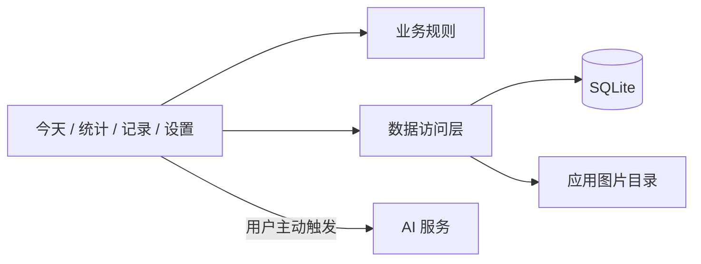

# 架构与公开范围

原生 App 使用 React Native / Expo Router。SQLite 是结构化记录的唯一事实源，图片保存在应用文件目录，凭据使用安全存储。

本仓库的 src 是业务规则提取包，覆盖 Rules 中的一部分，不包含界面和原生适配。提取时保留对应测试，避免为公开展示改写规则。

| 概念 | 用途 |
| --- | --- |
| Habit / Target | 测量方式、频率与目标 |
| CheckIn | 本地日期与实际记录 |
| Progress | 从记录计算当前进度 |
| Statistics | 按时间范围组织趋势与矩阵 |

HealthKit 当前仍是后续集成方向，Mock Provider 不能作为已接入系统健康数据的证据。JSON 导出与完整媒体备份也须分别描述。
